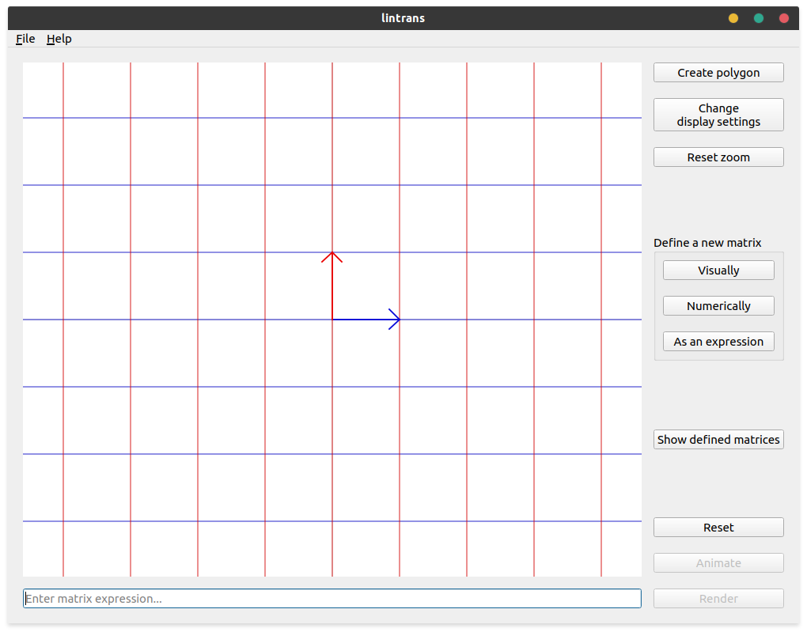

.. _anatomy-of-the-app:

Anatomy of the app
==================

When you open lintrans, you will be presented with something like this:

The main part is the `viewport` - the big grid taking up most of the window. This is where all the
linear transformations will actually be displayed.

Along the top is the menu bar, containing the ``File`` and ``Help`` options. ``File`` is used for
things like saving, loading, and resetting sessions, and ``Help`` is used to get to this tutorial,
report bugs, suggest features, and get information about the app.

On the right are a collection of buttons.
   - The top group allow you to define a custom polygon and see how it transforms, change how
     things are displayed in the viewport, and reset the zoom level.
   - The group in the middle allow you to :ref:`define new matrices<defining-matrices>` in
     different ways.
   - The next button allows you to :ref:`view all the matrices<defining-matrices.viewing>` you've
     already defined.
   - The last group handle :ref:`visualizing transformations<visualizing-transformations>`.

The text box along the bottom is the `expression input box`, which allows you to compose linear
transformations by writing expressions in terms of the matrices that you've defined.
