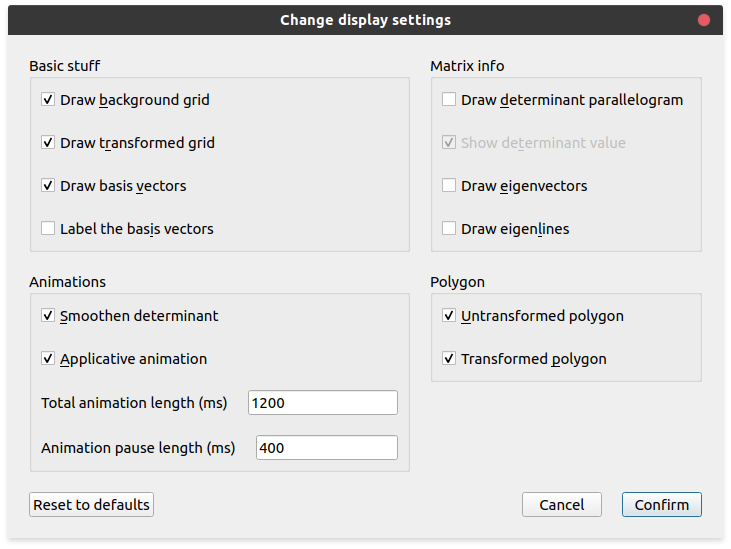
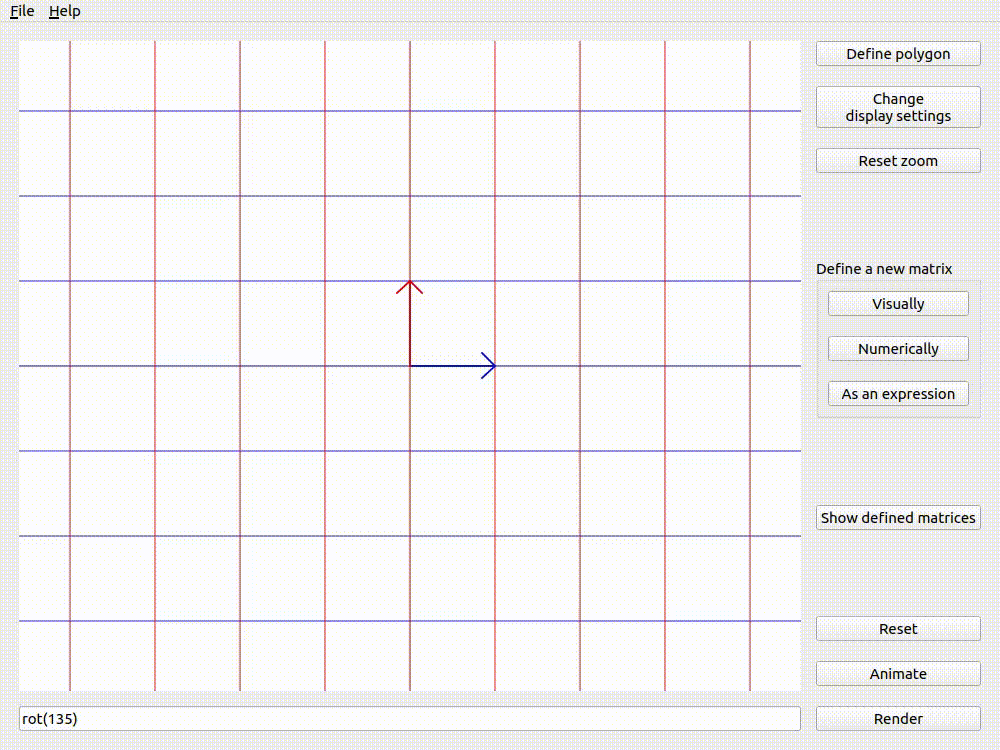
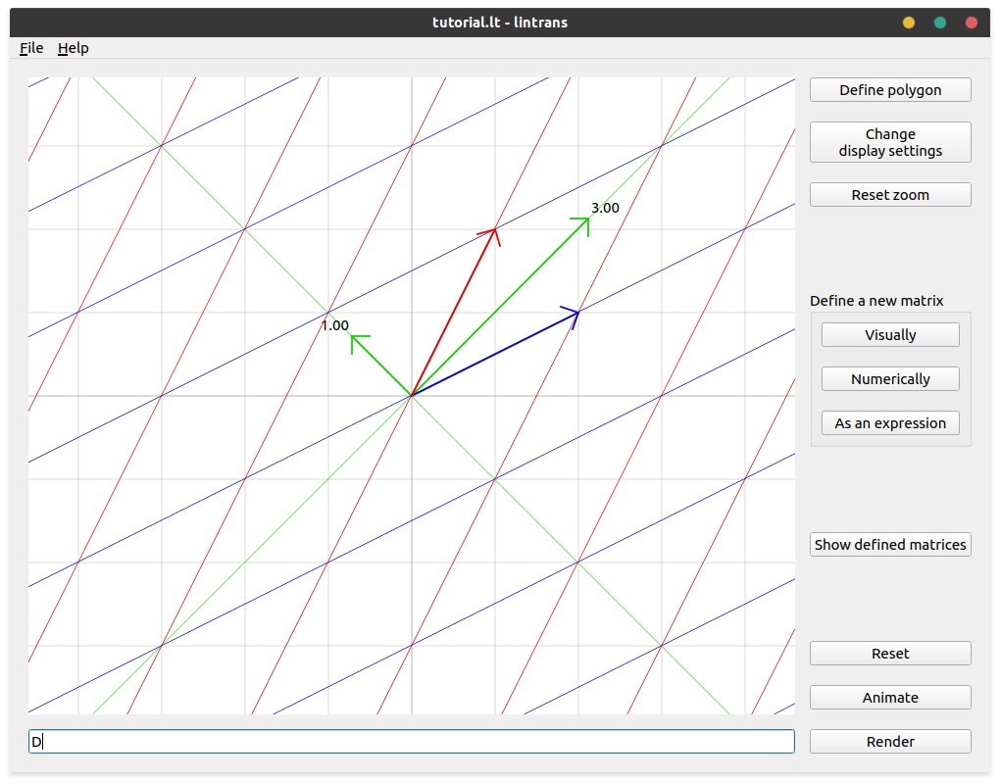

.. _configuring-display-settings:

Configuring display settings
============================

When you click the `Change display settings` button, you will be presented with this menu:

If you hover over any of the options, you'll get a tooltip explaining what the option does. If you
click the `Reset to defaults` button, then it will reset the settings back to these defaults.

Basic stuff
-----------

The `Basic stuff` section should hopefully be self-explanatory. If you want to enable or disable
the background grid, transformed grid, basis vectors, or their labels, this is where you can do it.
The basis vector labels require the basis vectors to be enabled.

Animations
----------

Smoothen determinant
^^^^^^^^^^^^^^^^^^^^

With this option disabled, the basis vectors will move in a straight line from their start to their
end positions. But with it enabled, lintrans will try to scale the determinant smoothly during the
animation. This makes most transformations look better, but sometimes you want to turn it off.

The effect of this option is very visible when animating a rotation by an obtuse angle with and
without smoothening the determinant.

   Animating ``rot(135)`` with `Smoothen determinant` on.

.. figure:: _images/display_settings/no-smoothen.gif
   :alt: ``rot(135)`` with `Smoothen determinant` off
   :align: center

   Animating ``rot(135)`` with `Smoothen determinant` off.

.. _configuring-display-settings.applicative-animation:

Applicative animation
^^^^^^^^^^^^^^^^^^^^^

Applicative animation is explained in :ref:`Visualizing
transformations<visualizing-transformations.animate.applicative>`. You can change between
Applicative and Transitive animation with this setting.

Animation timings
^^^^^^^^^^^^^^^^^

All animation timings are measured in milliseconds. 1 second is 1000 milliseconds.

lintrans also allows you to change the timings of animations. The `Total animation length` is the
total time taken for a single animation. If you're animating a sequence with commas, then each
single animation is an expression between commas, not the whole thing. This animation length may
not actually be the total length of the animation, because it's just a target. If the animation
involves drawing a lot of lines in the viewport, and especially if you're using an older computer,
there might be some lag.

The `Animation pause length` is the amount of time that the program will pause for between
expressions when animating a sequence with commas.

Matrix info
-----------

Determinant parallelogram
^^^^^^^^^^^^^^^^^^^^^^^^^

The determinant of a matrix is the amount by which its associated linear transformation scales
areas. This is often visualized as a parallelogram formed by the two basis vectors. This
parallelogram will move with the transformation. By default, it is labelled with the numeric value
of the determinant, but this also be toggled.

The parallelogram is blue when the determinant is positive and red when it's negative, so that you
can tell if orientation has been flipped even if you've got the numeric label turned off.

.. figure:: _images/display_settings/parallelogram.gif
   :alt: The determinant parallelogram shown for ``A^-1rot(90),Brot(45)``
   :align: center

   The determinant parallelogram shown for ``A^-1rot(90),Brot(45)``.

Eigenvectors and eigenlines
^^^^^^^^^^^^^^^^^^^^^^^^^^^

You may not have encountered eigenvectors before. Essentially, an eigenvector is a vector that
points in the direction of an invariant line. Not all matrices have invariant lines, but the
invariant lines that do exist must go through the origin (because the origin is fixed), so there
must be a set of vectors from the origin (position vectors) that lie along each invariant line. We
take one of these possible vectors to be "the" eigenvector associated with the invariant line.
Sometimes people choose a unit vector with length 1, but lintrans choose an eigenvector with length
equal to its associated eigenvalue.

An eigenvalue is essentially a scale factor associated with an invariant line, and thus with an
eigenvector. If you take a point on an invariant line with eigenvalue :math:`\lambda`, then after
the transformation, that point will still be on the line, but it will now be :math:`\lambda` times
its original distance from the origin. If you imagine the point as a position vector
:math:`\vec{\mathbf{v}}`, then the transformed point has the position vector
:math:`\lambda \vec{\mathbf{v}}`.

If :math:`\lambda` is negative, then the point will move to the other side of the origin. If
:math:`\lambda = 1`, then the line is also a line of invariant points, meaning nothing on the line
moves at all. :math:`\lambda` cannot be :math:`0` by definition.

An eigenline is just another word for an invariant line. lintrans allows you to visualize these
eigenlines and their associated eigenvectors.

   The eigenlines and eigenvectors for the matrix :math:`\begin{pmatrix}2 & 1\\1 & 2\end{pmatrix}`
   (defined as :math:`\mathbf{D}`), showcasing an invariant line and a line of invariant points.

.. _configuring-display-settings.polygons:

Polygons
--------

lintrans allows you to see a custom defined polygon before and after any given transformation. You
can show or hide both the transformed and untransformed versions separately with these display
settings.

See :ref:`Visualizing transformations<visualizing-transformations.defining-custom-polygons>` to see
what these polygons look like.
