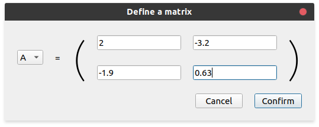
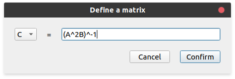

.. _defining-matrices:

Defining matrices
=================

lintrans is designed to visualise linear transformations, but the first step is to define some
matrices. This can be done in 3 ways, but they all share the same way of choosing a name.

lintrans requires all matrices to be defined before they can be used. Each matrix must be assigned
to one of 25 valid names. These are all the capital letters, except :math:`\mathbf{I}` (which is
reserved for the identity matrix). To select a name when defining a matrix, use the drop-down menu
on the left to select a letter.

Numerically
-----------

Defining a matrix numerically works exactly how you expect. Click the button labelled `Numerically`
under the heading `Define a new matrix`. You will be presented with 4 text boxes. These 4 boxes can
be filled in with numbers to create a matrix that looks like the ones in your textbooks. This
should be the most familiar way to define a matrix.

   The matrix :math:`\mathbf{A}` being defined as :math:`\begin{pmatrix}2 & -3.2\\ -1.9 & 0.63\end{pmatrix}`

Visually
--------

Defining a matrix visually allows you to drag the unit vectors around to define a transformation.
For example, if you want a transformation that stretches everything by a scale factor of 3 in the
:math:`x` direction and 2 in the :math:`y` direction, then you can simply drag the basis vectors to
where they would be after that transformation, and the program will save the corresponding matrix
to whatever name you chose.

.. figure:: images/defining/visually.png
   :alt: The visual definition dialog
   :align: center

   The matrix :math:`\mathbf{B}` being defined as :math:`\begin{pmatrix}3 & 0\\ 0 & 2\end{pmatrix}`

.. _defining-matrices-as-expression:

As an expression
----------------

lintrans also supports matrices being defined in terms of other matrices. Any expression that is
valid in the `expression input box` is valid as an expression to define a new matrix. See
:ref:`Expression syntax<expression-syntax>` for what counts as a valid expression.

   The matrix :math:`\mathbf{C}` being defined as :math:`(\mathbf{A}^2\mathbf{B})^{-1}`

One advantage of this method, is that the matrix is re-evaluated each time it is needed. So for
this example, if you change the value of :math:`\mathbf{A}` or :math:`\mathbf{B}`, then
:math:`\mathbf{C}` updates automatically.

It is impossible to define a matrix in terms of a matrix which is not already defined, or in terms
of itself.

Viewing defined matrices
------------------------

Once you've defined several matrices, it's useful to be able to see what you've defined so far. To
do this, click the button labelled `Show defined matrices`.

The matrix :math:`\mathbf{I}` is reserved for the identity matrix and you cannot
assign a new matrix to this name.

.. image:: images/defining/info.png
   :alt: The defined matrices info dialog
   :align: center
