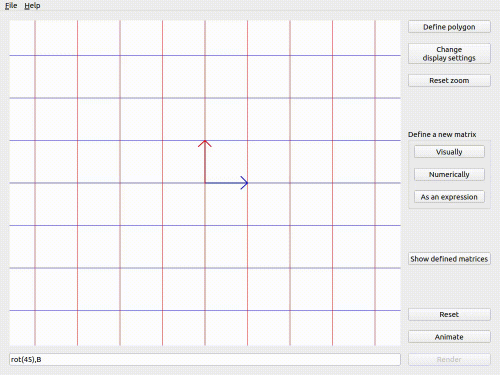
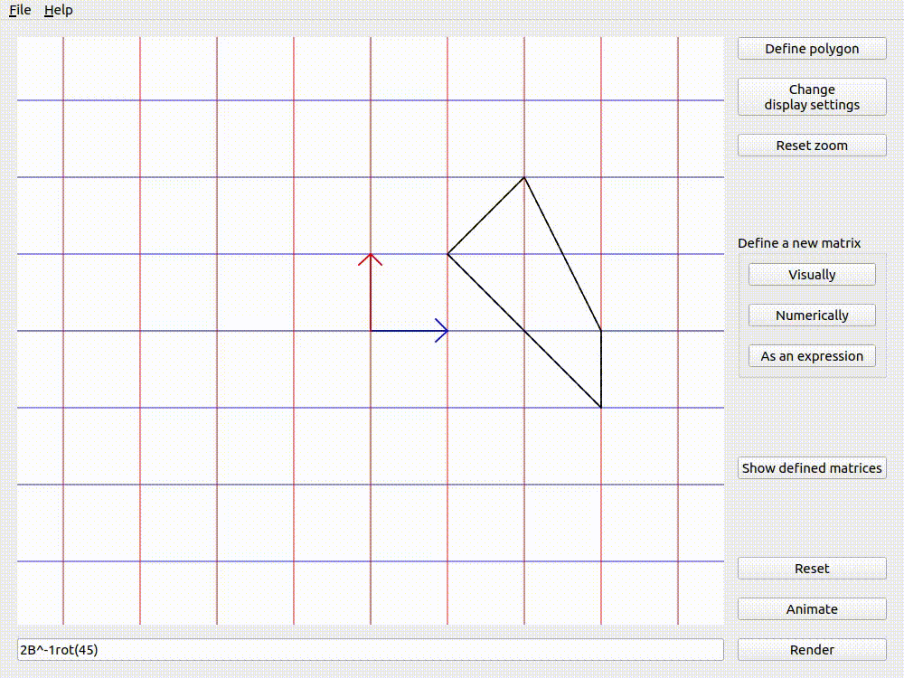

.. _visualizing-transformations:

Visualizing transformations
===========================

The bottom group of buttons on the right are for actually visualizing transformations. This is the
crux of the app.

The reset button simply resets the position of the basis vectors to the identity. It does not reset
the zoom level, display settings, or polygon. These are done separately.

Render
------

When rendering an expression, the app will evaluate whatever expression you've typed into the
`expression input box`, and just render it in the viewport. This means it will put the :math:`i`
vector at the position specified by the first column, and the :math:`j` vector at the position
specified by the second.

If you render the same expression twice in a row, then it will be exactly the same as just
rendering it once.

Animate
-------

The animate button does exactly as it says - it animates. However, there are two distinct types of
animation - Transitive and Applicative. The default is Applicative, but you can change it in the
:ref:`display settings<configuring-display-settings.applicative-animation>`.

Animation also supports the use of commas to separate expressions. Each expression between commas
must be valid on its own. These expressions will be animated one-by-one, going from left to right.

Transitive
^^^^^^^^^^

Transitive animation is the simplest form. It's basically just rendering, but instead of the basis
vectors jumping to their new positions, they get dragged there and you can watch them move.

If you animate the same expression twice with Transitive animation, the first time will look like
an animation, but the second time will look like nothing happens. This is because each point gets
dragged to its new position, which is exactly the same as its current position, so nothing actually
moves.

.. _visualizing-transformations.animate.applicative:

Applicative
^^^^^^^^^^^

Applicative animation is much more interesting, and is one of the reasons I decided to make
lintrans in the first place.

Let's define a matrix :math:`\mathbf{C}` to represent whatever is currently being displayed in the
viewport. If the result of evaluating the `expression input box` is a matrix :math:`\mathbf{E}`,
and we want to render a target matrix :math:`\mathbf{T}`, then :math:`\mathbf{T} = \mathbf{EC}`.

Intuitively, Applicative animation takes the transformation represented by the given expression and
`applies` it to the current state of the viewport, hence the name.

If you animate the same matrix ``A`` twice with Applicative animation, then the end
result will be the same as rendering ``A^2``, **IF** you started from the identity. If start by
rendering a matrix ``B``, and then animate ``A`` twice, then you'll end up with what you would get
if you just rendered ``A^2B``.

With Applicative animation, commas do not affect the final result. They just show you the steps
taken to get there. But when using commas with Transitive animation, the result is the same as just
rendering the expression on the left.

The examples below (using Applicative animation and the matrix :math:`\mathbf{B}` from
:ref:`defining matrices visually<defining-matrices.visually>`) show that the order of matrices in
the expression changes the result of animation. This is because matrix multiplication is
non-commutative.

   Animating ``rot(45),B`` with Applicative animation

.. figure:: _images/visualizing/Brot.gif
   :alt: Animating ``B,rot(45)`` with Applicative animation
   :align: center

   Animating ``B,rot(45)`` with Applicative animation

Using input and output vectors
------------------------------

.. note:: I/O vectors are currently not implemented.

.. _visualizing-transformations.defining-custom-polygons:

Defining custom polygons
------------------------

It is often useful to think about a shape and how it would get transformed by a given matrix.
lintrans allows you to define a polygon using the `Define polygon` button. Clicking it will open a
dialog box where you can click to add as many vertices to the polygon as you would like. You can
drag vertices around, they will snap to integer coordinates, and you can delete vertices by right
clicking on them.

You can then see this polygon before and after the transformation when you render or animate an
expression. The before and after versions can be independently hidden in the :ref:`display
settings<configuring-display-settings.polygons>`.

   The version with the dashed outline is the untransformed version, whereas the one with the solid
   outline has been transformed by :math:`2\mathbf{B}^{-1}\mathbf{R}_{45}`.
